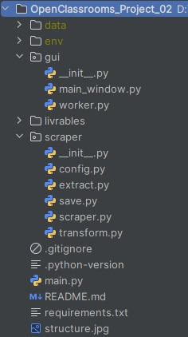

# OpenClassrooms_Project_02
**Project 02 : Automate a task - Book scraper in Python**

## DESCRIPTION

This project was completed as part of the "Python Developer" path at OpenClassrooms.

The goal was to develop a Python script capable of:
- Scraping all books from the [Books to Scrape](https://books.toscrape.com) website,
- Saving the extracted data into CSV files,
- Downloading the image of each book.

The website contains 1000 books across 50 categories.

## PROJECT STRUCTURE

  

## INSTALLATION

**-Clone the repository :**  
`git clone https://github.com/Tit-Co/OpenClassrooms_Project_02.git`

**- Navigate into the project directory :**  
`cd OpenClassrooms_Project_02`

**- Create a virtual environment :**  
`python -m venv env`

**-Activate the virtual env :**  
`source env/bin/activate`  
Or  
`source env\Scripts\activate` on Windows  

**-Install dependencies**  
`pip install -r requirements.txt`  

## USAGE

**Run the main script**  
`python main.py`

After execution, the results will be available in the data/ directory:  
- book.csv contains all book datas.  

Images are saved in subfolders by category.  

Two logs are generated if errors:  
- image_download_errors.txt for any failed image downloads,
- skipped_images.txt for images that were already downloaded.

## TECHNICAL JUSTIFICATIONS

- **One folder per book image**: Ensures flexibility in case future updates include multiple images per book.
- **Filename sanitization**: Spaces, quotes, accented characters, and symbols are handled to ensure compatibility with file systems.
- **Logging**: Robust error logging is implemented for skipped or failed downloads.
- **Use of UPC in filenames**: Guarantees uniqueness, especially for books with similar titles or from multiple categories.

## DEPENDENCIES

beautifulsoup4,
requests,
unidecode,
urllib3,

## AUTHOR

**Name**: Nicolas MARIE  
**Track**: Python Developer – OpenClassrooms  
**Project – Web scraping script** – July 2025  
